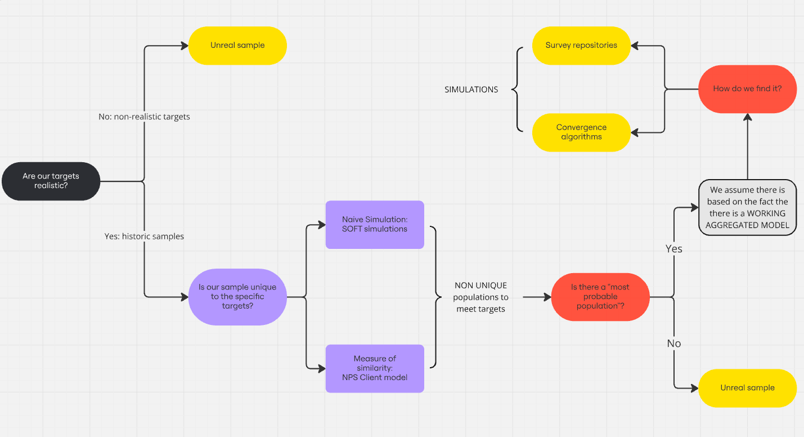
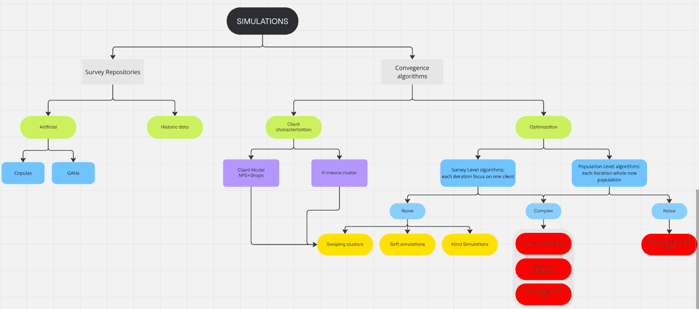

# Simulations: Project Overview

This project focuses on the robust generation of a survey population that meets specified targets for key descriptive variables. The objectives correspond to the satisfaction levels in the sample (% of responses ≥ 8) for each of the customer experience touchpoints of interest to Iberia, including punctuality, check-in, food, and others.

The main goal is to simulate a population of surveys that accurately reflects these satisfaction levels while maintaining consistency and realism in the data.

## Summary Diagram

To visually summarize the simulation process and its challenges, refer to the following diagram:

# Can We Simulate the Population of Customers That Meets Specific Targets?

### Key Questions:

1. **"The Population"**:  
   - How can we determine if the population that meets the targets is unique?  
   - If the population is not unique, what approach can we take to generate a *probable* population?

2. **"Simulate"**:  
   - Is there a robust and generalizable methodology to create populations that reliably meet the given targets?  

---

## Defining the Problem

To address these questions, the first step is to create a controlled test environment—our **simulation laboratory**—to isolate and validate the quality of the simulations. The goal of this laboratory is to establish a methodology robust enough to provide confidence in the results and ultimately generalize the approach to real-world scenarios.  

---

## Laboratory and Verification Tools

### Historical Data as a Baseline:  
To ensure realism, we define the simulation targets based on historical data rather than arbitrarily creating them. This approach leverages known patterns and relationships in customer feedback, providing a reliable foundation for the simulation.

### The Key Question:  
Given fixed, realistic targets—where relationships between variables are known—**can we simulate a sample population that achieves these targets while maintaining consistency with the historical data?**

---

## Verification Methodology

Since we are developing a methodology that will later be generalized, we can directly compare the simulated sample against the historical population associated with the selected targets. This comparison allows us to assess the fidelity of the simulated population. But how can we effectively compare these samples?  

### Comparison Approach:  
In the **Explanatory Drivers** project, we developed a methodology to predict and explain the Net Promoter Score (NPS) at the individual customer level. This methodology is based on **two binary classifiers** trained on historical survey data:  

1. **Promoter Classifier**: Predicts the probability that a customer is a promoter.  
2. **Detractor Classifier**: Predicts the probability that a customer is a detractor.  

From the difference between these two probabilities, we calculate the predicted NPS for each customer. Additionally, both classifiers are designed to provide **explainability** by identifying the contribution of each touchpoint to the respective predictions (promoter or detractor). This dual approach allows us to derive not only a predicted NPS but also an **explanation of the NPS** for each individual customer.  

### Comparing Simulated vs. Historical Populations:  
To evaluate whether the simulated population aligns with the historical data, we aggregate the individual-level characterizations (predicted NPS and explainability scores) for both the simulated and historical populations. If the averaged results differ significantly between the two populations, it indicates that the individual-level profiles (customers or surveys) in the simulated sample are not consistent with the historical sample.

This rigorous comparison ensures that the simulated population matches not only the overall targets but also the underlying distribution of individual characteristics, providing confidence in the quality of the simulation.

---

## Initial Findings

Our initial experiments provided valuable insights into the uniqueness and realism of simulated populations:

### Experiment 1: Soft Simulations
To test whether there can be more than one population of customers meeting the same targets, we conducted a quick experiment called **soft simulations**.  
- **Methodology**: We selected a historical period as the target population and used the same period from the previous year as a baseline. Then, we minimally altered each customer’s satisfaction scores to meet the targets. Specifically, we:
  - Increased some scores of `7` to `8`, or
  - Decreased some scores of `8` to `7`.  
  Each customer had at most one score adjusted, either up or down, to change the satisfaction levels.  

- **Results**:  
  The simulated population met the satisfaction targets, but the predicted NPS for the simulated sample differed significantly from the target population’s NPS. Surprisingly, the simulated NPS was much closer to the original (unaltered) population's NPS. This indicated that:
  1. **The individual customers in the simulated sample, though not real, were realistic** in terms of their profiles and characteristics.  
  2. The issue lay in the **overall population**, which was no longer realistic, despite the individual customers being plausible.  

This revealed a critical insight: there can be more than one population of realistic customers (e.g., the soft-simulated and original populations) that meet the same satisfaction targets but yield different NPS values.  

### Experiment 2: Hard Simulations
To further explore the variability of simulated populations, we developed a **hard simulation** algorithm:  
- **Methodology**: Instead of altering only one score per customer, we simultaneously increased or decreased scores for multiple variables (e.g., several touchpoints). This introduced more substantial changes to customer profiles while still ensuring the satisfaction targets were met.  

- **Results**:  
  The NPS of the hard-simulated population exhibited greater variability compared to the soft simulations, confirming that:
  1. **Different simulation methods produce populations with varying NPS values**, even when satisfaction targets are met.  
  2. The realism of the population as a whole depends not only on individual customer adjustments but also on the relationships between those adjustments across the entire dataset.

---

These experiments underscore the existence of **multiple possible customer populations (n)** that meet the same satisfaction targets. The challenge lies in defining additional constraints or selecting a methodology that prioritizes the most probable or useful population for real-world applications.

This result raises Question 2: **How do we define and narrow down a probable population, case by case?** The aggregated model gives us an approximation to the correct population. We attempt to vary each customer more to cause more variation in NPS and check with a **hard check**.

# Technical Lanscape

To visually summarize the simulation process and its challenges, refer to the following diagram:

